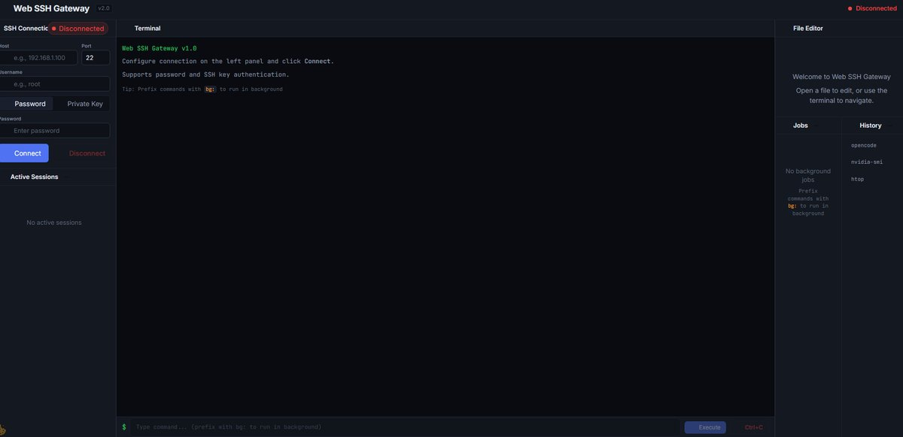

# Web SSH Gateway — API-first SSH for agents and infrastructure teams

[]() []() []() []() [](SECURITY.md) []()

Web SSH Gateway exposes SSH as HTTP and WebSocket APIs: connect to hosts, run commands, stream interactive PTY sessions, edit files, and audit activity from agents, CI/CD pipelines, or internal tools.

Unlike traditional browser SSH clients, it is designed around SSH-as-API rather than human-only terminal access.

Runs as a simple Docker Compose stack with FastAPI, PostgreSQL and Redis.

```bash
docker compose up -d && curl -H "X-API-Key: $API_KEY" http://localhost:8085/api/servers
```

---

> **⚠️ Production warning.** Do not expose this gateway directly to the internet without TLS, strong API keys, mTLS or SSO, CIDR allowlist, audit logging, and secret rotation. See [Security](#-security) and [SECURITY.md](SECURITY.md) for details.

---

## Why not Guacamole?

| Project | Focus | Deployment | Auth | API | Session persistence |
|---------|-------|-----------|------|-----|-------------------|
| **Web SSH Gateway** | API-first SSH for AI agents & infra | Docker Compose stack, `docker compose up` | API Key / mTLS / SSO | REST + WebSocket | PostgreSQL (survives restart) |
| Apache Guacamole | Remote desktop (RDP/VNC/SSH) | 5+ containers, Tomcat, MySQL | LDAP/SAML/CAS | Guacamole protocol only | In-memory |
| Sshwifty | Browser SSH client | 1 binary | HTTP basic auth | None (UI only) | None |
| Warpgate | Transparent SSH bastion | 1 binary | SSH key / OIDC | Admin API only | SQLite |

Unlike traditional browser SSH clients, **Web SSH Gateway** is designed around SSH-as-API: agents, CI/CD pipelines, and automated workflows call SSH via HTTP and WebSocket primitives, not direct shell access.

---

## Screenshots



---

## Restart-safe SSH sessions

Gateway-managed SSH sessions survive container restarts at the API level: agents keep using the same `session_id`, while the gateway restores credentials from PostgreSQL and reconnects to the target host automatically.

```bash
# Terminal A: connect
curl -X POST -H "X-API-Key: $API_KEY" \
  -d '{"host":"10.0.0.5","username":"deploy","password":"..."}' \
  http://localhost:8085/api/ssh/connect
# → {"session_id": "abc123"}

# Terminal B: restart the gateway
docker compose restart web

# Terminal A: same session_id still works
curl -X POST -H "X-API-Key: $API_KEY" \
  -d '{"session_id":"abc123","command":"uptime"}' \
  http://localhost:8085/api/ssh/execute
```

Session credentials encrypted at rest in PostgreSQL, decrypted in-memory on reconnect. Agents don't need to know the password — only the `session_id`. Already-running remote processes depend on how they were started on the target host (the gateway reconnects the SSH transport, not the remote shell state).

**Why it matters:** Agents don't need to create a new session. They keep using the same `session_id`, and the gateway handles reconnect and re-auth internally.

---

## Features

| Domain | Capability |
|--------|-----------|
| **SSH Sessions** | Connect, execute, disconnect, auto-reconnect — key or password auth |
| **Interactive PTY** | Full-duplex WebSocket — run `vim`, `htop`, `nano`, resize the terminal |
| **File Operations** | Read, write, patch, batch edit over REST — no SCP, no SFTP |
| **Background Jobs** | Fire-and-forget execution, SSE streaming, Redis queue survives crashes |
| **Git Integration** | Status, diff, commit, stash, init — agent doesn't need `git` installed |
| **Security** | 3-layer auth, CIDR allowlist, rate limiting, audit log |
| **Command Guardrails** | basic dangerous-command blocklist, path traversal protection |
| **Persistence** | PostgreSQL session store — gateway restart doesn't lose session metadata |
| **Agent API** | Short-lived tokens with TTL, separate from admin API key |

---

## Who is this for?

- **Infra teams** — API-driven SSH for automation and orchestration
- **AI agents / Codex / Copilot** — programmatic SSH access with short-lived tokens
- **Internal platforms** — embed SSH in your web UI without building a terminal from scratch
- **CI/CD systems** — one-shot commands across fleets via REST
- **Developers** — browser-based SSH with session persistence across restarts

### Who is this not for?

- **End-user remote desktop** — for VNC/RDP/Guacamole-style access, use Apache Guacamole
- **Public-internet SSH** — this gateway needs a bastion, SSO, or mTLS in front; don't expose it raw
- **Casual browser terminal** — Sshwifty or Warpgate are simpler if you just want a browser shell
- **Legacy enterprise** — no LDAP/SAML/CAS yet (SSO via Authelia is supported downstream)

---

## Quick Start

```bash
git clone https://github.com/gpakoh/web-ssh-gateway.git
cd web-ssh-gateway
cp .env.example .env        # set API_KEY, DATABASE_URL, REDIS_URL
docker compose up -d --build
curl -H "X-API-Key: $API_KEY" http://localhost:8085/health
```

That's it. Three containers (gateway, postgres, redis), zero external infrastructure.

---

## ⚡ API at a glance

Three calls — connect, execute, disconnect. Everything else is a variation.

```bash
# 1. Connect to a host
curl -X POST -H "X-API-Key: $API_KEY" \
  -d '{"host":"10.0.0.5","username":"deploy","password":"..."}' \
  http://localhost:8085/api/ssh/connect
```

```json
// Response
{ "session_id": "abc123", "host": "10.0.0.5", "port": 22, "connected_at": "..." }
```

```bash
# 2. Run a command
curl -X POST -H "X-API-Key: $API_KEY" \
  -d '{"session_id":"abc123","command":"uptime && who"}' \
  http://localhost:8085/api/ssh/execute
```

```json
// Response
{ "session_id": "abc123", "exit_code": 0, "stdout": " 13:45:22 up 42 days, ...", "stderr": "" }
```

```bash
# 3. Close the session
curl -X POST -H "X-API-Key: $API_KEY" \
  -d '{"session_id":"abc123"}' \
  http://localhost:8085/api/ssh/disconnect
```

---

## 🧪 Try it locally

Don't have a remote server? Start a demo SSH server with the gateway:

```bash
docker compose --profile demo up -d test-sshd
```

Then connect using the predefined credentials:

```bash
curl -X POST -H "X-API-Key: $API_KEY" \
  -d '{"host":"ssh-gateway-test-sshd","username":"root","password":"test123","port":22}' \
  http://localhost:8085/api/ssh/connect
```

Or use any local SSH server with `host: "host.docker.internal"` (Docker Desktop) or your LAN IP.

---

## Access Modes

### Local network (direct)
- Base URL: `http://localhost:8085`
- No SSO required.
- Recommended for internal agents and CI runners inside LAN.

### Internet (via Authelia SSO)
- Base URL: `https://gateway.example.com`
- Requests must pass Authelia SSO (cookie session) before reaching the gateway.
- Use personal credentials and avoid storing secrets in scripts or docs.

---

## 📡 WebSocket PTY

Not HTTP polling. A single persistent channel per session for bidirectional terminal I/O — same protocol as VS Code remote SSH:

```javascript
const ws = new WebSocket("wss://gateway.example.com/api/ssh/pty/{session_id}/stream");

ws.onopen = () => ws.send(JSON.stringify({ term: "xterm-256color", rows: 24, cols: 80 }));

ws.send(JSON.stringify({ type: "input", data: "ls -la\n" }));

ws.onmessage = (e) => {
  const msg = JSON.parse(e.data);
  if (msg.type === "output") terminal.write(msg.data);
};

ws.send(JSON.stringify({ type: "resize", rows: 40, cols: 120 }));
```

---

## Architecture

```
Browser / Agent / CI
    │
    ▼
Nginx (SSL termination, mTLS verify, rate limit, SSO proxy)
    │
    ▼
FastAPI Gateway
    ├── HTTP API (REST endpoints)
    ├── WebSocket PTY (/api/ssh/pty/{id}/stream)
    ├── Job Queue (Redis)
    ├── Session Store (PostgreSQL)
    └── SSH Engine (Paramiko in async executor threads)
          │
          ▼
    Target Servers (any SSH host)
```

**Key decisions:**
- **Paramiko in executor threads** — SSH is inherently blocking; threading matches reality
- **PostgreSQL persistence** — gateway restart doesn't lose agent sessions
- **Redis job queue** — long-running commands survive process crash
- **Circuit breaker per host** — one down node doesn't cascade

---

## 🔒 Security

### Credential Storage
- SSH passwords and private keys encrypted at rest with **Fernet** (AES-128-CBC + HMAC-SHA256)
- Encryption key from `ENCRYPTION_KEY` env var — never in code, never in config files
- Decrypted only in-memory at connection time, never written to disk

### Transport
- **TLS 1.3** required for production
- **Optional mTLS** — agents present client certificate, Nginx validates before proxying
- **Host key verification** — by default uses `AutoAddPolicy` (accepts unknown host keys). For production set `SSH_STRICT_HOST_KEY_CHECKING=true` to reject unknown hosts

### Authentication (three independent layers)
| Layer | Who | Mechanism |
|-------|-----|-----------|
| 1. API Key | Scripts, CI/CD | `X-API-Key` header, validated against config |
| 2. mTLS | Automated agents | Client certificate, `ssl_verify_client optional` |
| 3. SSO | Human operators | Authelia / OpenID Connect, cookie-based session |

Any layer can grant access — valid mTLS cert bypasses SSO entirely.

### Authorization
- **CIDR allowlist** per endpoint — configurable via `ALLOWED_CLIENT_CIDRS`
- **Path traversal protection** — `../`, `~`, `/etc/passwd`, `/proc`, `/sys` blocked
- **Command guardrails** — basic dangerous-command blocklist (`rm -rf /`, pipe-to-shell, etc.). This is a guardrail against accidental destructive commands, not a sandbox. Use OS-level permissions, dedicated users, chroot/containers, and sudo policies for real isolation.

### Rate Limiting
| Endpoint | Limit |
|----------|-------|
| SSH connect | 10 requests/minute |
| Command execute | 60 requests/minute |
| File edit | 30 requests/minute |
| Bulk operations | 10 requests/minute |
| Batch operations | 20 requests/minute |

### Session Isolation
- Each `session_id` maps to exactly one SSH channel
- Sessions isolated per connection — no cross-session access
- WebSocket tokens invalidated on disconnect
- Stale sessions (5 min idle) auto-cleaned

### Audit
Every operation logged with structured event type:
- `COMMAND` — command executed, exit code, output size
- `FILE` — file read/write/edit, path, diff
- `AUTH` — auth attempt, source IP, result
- `SECURITY` — blocked paths, rate limit hits, CIDR denies

---

## Tech Stack

| Component | Technology |
|-----------|-----------|
| **Runtime** | Python 3.11+, FastAPI, Uvicorn |
| **SSH Engine** | Paramiko (async via `loop.run_in_executor`) |
| **Database** | PostgreSQL 16 + SQLAlchemy 2.0 (async) |
| **Queue** | Redis 7 + sorted sets (priority + dead letter) |
| **Frontend** | Vanilla JS, xterm.js-compatible |
| **Reverse Proxy** | Nginx (SSL, mTLS verify, rate limit) |
| **Container** | Docker Compose (3 containers) |

### Compatibility

| Dependency | Version | Notes |
|-----------|---------|-------|
| Python | 3.11+ | Tested in CI (node:20-bookworm) |
| Docker | 24+ | Compose v2 |
| PostgreSQL | 16 | SQLAlchemy 2.0 async |
| Redis | 7 | Sorted sets, pub/sub |
| Nginx | 1.24+ | Stream module for rate limiting |
| Paramiko | 3.4+ | SSH transport layer |

---

## Testing

```bash
# Unit tests (mocked SSH, no external deps)
pytest -q

# Live SSH integration (requires local sshd)
pytest -m integration

# Coverage
pytest --cov=app --cov-report=term-missing
```

- 119 unit tests (mock-based)
- 4 integration tests (live paramiko + sshd)
- 6 rate-limit tests
- 5 persistent session tests

**Every CI run includes:**
- CycloneDX SBOM generation (`cyclonedx-py`)
- Dependency vulnerability scan (`pip-audit` with `--strict`)

---

## Roadmap

- [x] WebSocket PTY (full-duplex, resize)
- [x] Persistent sessions (PostgreSQL restore on restart)
- [x] Rate limiting & circuit breaker per host
- [x] Integration test suite with live sshd
- [ ] Horizontal scaling (sticky sessions for multi-instance)
- [ ] Local LLM code generation adapter (Ollama / llama.cpp)

---

## License

MIT
